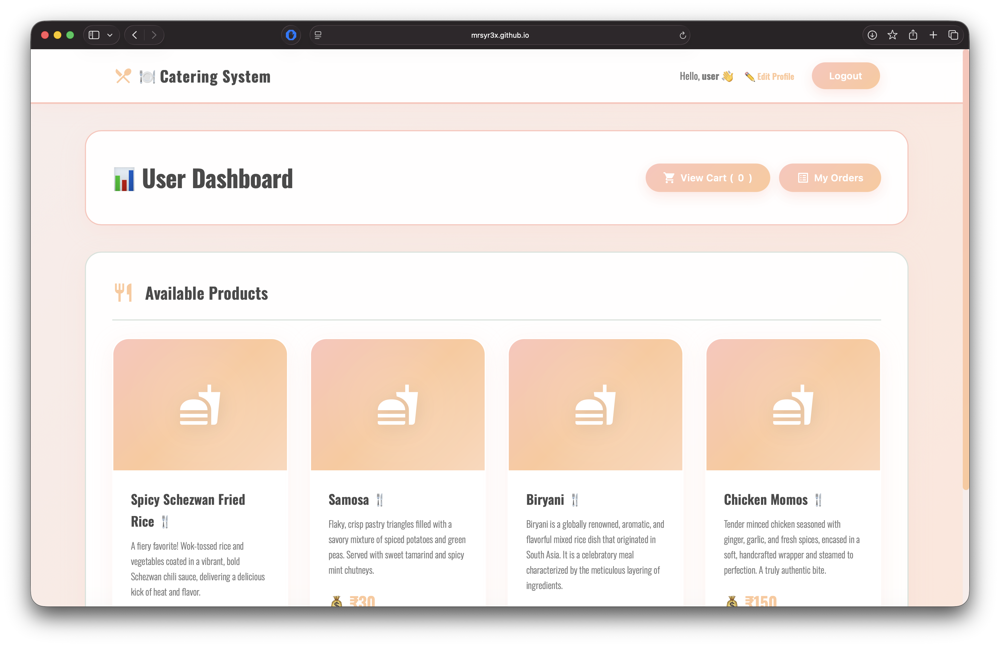

# 🍽️ Catering Reservation and Ordering System  
**🌍 Live Demo:** [https://mrsyr3x.github.io/catering-system/](https://mrsyr3x.github.io/catering-system/)


**Empowering rural entrepreneurs to bring authentic Indian catering services to the global stage.**  

---

## 🖼️ Preview  


---

## 🌐 Overview

The **Catering Reservation and Ordering System** is a modern web application that connects local caterers with customers worldwide.  
It’s designed to give rural and small-scale entrepreneurs a digital presence, enabling them to **showcase their traditional Indian dishes** and expand their reach beyond local boundaries.

The system provides **two portals** — one for users to browse and order catering services, and another for admins (vendors) to manage products and orders.  
Built using **HTML, CSS, JavaScript, and Firebase**, this project emphasizes **security, performance, and modularity** while maintaining a visually elegant design inspired by **Indian warmth and hospitality**.

---

## ✨ Key Highlights

- 🛒 Complete order management workflow — from browsing menus to confirming orders  
- 🔐 Firebase-based authentication for users and admins  
- 💡 Modular JavaScript architecture with clean separation of concerns  
- 📱 Fully responsive design optimized for mobile, tablet, and desktop  
- 💬 Comprehensive console logging for debugging and maintenance  
- 🎨 Smooth animations, pastel colors, and subtle glassmorphism UI  

---

## 💻 Tech Stack

| Layer | Technology |
|-------|-------------|
| **Frontend** | HTML5, CSS3, JavaScript (ES6) |
| **Backend / Database** | Firebase Firestore |
| **Authentication** | Firebase Authentication |
| **Hosting (Optional)** | Firebase Hosting |
| **Logging** | JavaScript console logging & error handling |

---

## 👥 User Features

1. **Register and Login** — Users can create accounts and securely log in using Firebase Authentication.  
2. **View Products** — Browse the list of available catering dishes, complete with images, names, and pricing.  
3. **Add to Cart** — Add selected dishes to a virtual shopping cart for later checkout.  
4. **My Orders** — View active, completed, and canceled orders with timestamps and order details.  
5. **Place Order** — Confirm orders, which are then saved in Firestore and visible to admins.  
6. **My Profile** — Edit personal details, manage saved preferences, and update contact info.  

---

## 🧑‍🍳 Admin Features

1. **Register and Login** — Secure Firebase authentication for administrators or vendors.  
2. **Upload Products** — Add, update, and delete menu items (title, price, category, description, image).  
3. **View Orders** — Access all incoming user orders with details and timestamps.  
4. **Update Order Status** — Change order states (e.g., *Pending → Preparing → Delivered*).  

---

## 🎨 Design Philosophy

Aiming to blend **elegance with simplicity**, the system’s design takes inspiration from the inviting warmth of traditional Indian hospitality.  

- **Color Palette:** Soft pastel tones — Melon 🍈, Peach 🍑, Apricot 🍊  
- **Typography:** Clean and strong **Oswald** font for headings; open, readable sans-serif for body text  
- **Visuals:** Gentle gradients, transparent glassmorphism panels, and responsive cards  
- **Animations:** Smooth CSS transitions for hover effects, modals, and page elements  
- **Layout:** Fluid grid system that adjusts seamlessly across devices  

The interface is **accessible, responsive, and intuitive**, ensuring that users can order meals effortlessly whether they’re using a mobile phone, tablet, or laptop.

---

## ⚙️ Project Structure

```
.
├── admin-dashboard.html
├── css
│   └── style.css
├── index.html
├── js
│   ├── admin.js
│   ├── auth.js
│   ├── firebase-config.js
│   ├── profile.js
│   └── user.js
├── login.html
├── profile.html
├── README.md
├── register.html
└── user-dashboard.html
```

### 📂 Explanation

- **index.html** — Landing page for general users with intro and navigation  
- **login.html / register.html** — Authentication pages connected to Firebase  
- **user-dashboard.html** — Main user interface for browsing, adding to cart, and placing orders  
- **admin-dashboard.html** — Admin panel for managing items and tracking user orders  
- **profile.html** — User profile management and editable account settings  
- **css/style.css** — All styling, including animations, color themes, and responsiveness  
- **js/firebase-config.js** — Firebase initialization and configuration keys  
- **js/auth.js** — Handles login, logout, and registration flows  
- **js/user.js** — Manages product retrieval, cart handling, and order placement  
- **js/admin.js** — Handles product uploads, updates, and order management for admins  
- **js/profile.js** — Manages user profile viewing and updates  

---

## 🚀 Quick Start Guide

### 1. Clone the Repository
```bash
git clone https://github.com/MrSyr3x/catering-system.git
cd catering-system
```

### 2. Setup Firebase
1. Go to [Firebase Console](https://console.firebase.google.com/).  
2. Create a new project named **Catering Reservation and Ordering System**.  
3. Enable **Authentication** (Email/Password).  
4. Create a **Cloud Firestore** database in *test mode* for initial development.  
5. Copy your Firebase configuration and replace it in:
   ```js
   // js/firebase-config.js
   const firebaseConfig = {
       apiKey: "YOUR_API_KEY",
       authDomain: "YOUR_PROJECT_ID.firebaseapp.com",
       projectId: "YOUR_PROJECT_ID",
       storageBucket: "YOUR_PROJECT_ID.appspot.com",
       messagingSenderId: "YOUR_SENDER_ID",
       appId: "YOUR_APP_ID"
   };
   ```

### 3. Run the Application
- Simply open `index.html` in your browser (no server required).
- Or host it using:
  ```bash
  firebase deploy
  ```

---

## 🔒 Security

- 🔐 **Firebase Authentication** secures all user and admin logins.  
- 🧾 **Firestore Security Rules** restrict unauthorized access to order and product data.  
- ⚙️ **Input Validation** prevents malformed entries in form submissions.  
- 🧱 **Error Handling** in every JS module ensures consistent failure responses.  
- 🔍 **Console Logging** for every CRUD operation to aid debugging and audits.  

Example log message:
```js
console.log(`[ORDER] New order placed by ${userEmail} at ${new Date().toISOString()}`);
```

---

## 🧭 How to Use

### 👤 For Users
1. **Register/Login** to create an account.  
2. Browse catering options available on the dashboard.  
3. Click **Add to Cart** to select desired dishes.  
4. Review the **Cart** and confirm to **Place Order**.  
5. Track order status in **My Orders**.  
6. Update personal information in **My Profile**.

### 🧑‍💼 For Admins
1. Log in using admin credentials.  
2. Access **Admin Dashboard**.  
3. Upload new food items via the product form.  
4. View and update orders as they are placed by users.  
5. Change order statuses (Pending → Preparing → Delivered).  

---

## 🧩 JavaScript Modules Breakdown

| Module | Purpose |
|---------|----------|
| **firebase-config.js** | Firebase app initialization and configuration |
| **auth.js** | Handles authentication, registration, and logout |
| **user.js** | User-side logic (products, cart, orders) |
| **admin.js** | Admin-side logic (uploading, managing orders) |
| **profile.js** | Profile viewing and editing |

Each module is **independent**, ensuring separation of concerns and easy debugging.

---

## 🧪 Troubleshooting

| Issue | Possible Cause | Solution |
|--------|----------------|-----------|
| Firebase not loading | Incorrect config | Verify keys in `firebase-config.js` |
| Authentication fails | Disabled sign-in provider | Enable *Email/Password* in Firebase console |
| Orders not saving | Firestore permissions | Check Firestore security rules |
| Styling breaks | Cached CSS | Hard-refresh or clear cache |
| Images not showing | Incorrect file path | Ensure `images/` or links are correct |

If console shows `Permission denied`, double-check your **Firestore rules** to ensure correct read/write permissions for authenticated users.

---

## 📱 Device Support

✅ Fully responsive layout  
✅ Tested on major browsers (Chrome, Safari, Edge, Firefox)  
✅ Works seamlessly on:
- Desktop 💻  
- Tablets 📲  
- Smartphones 📱  

Uses **flexbox and CSS grid layouts** to adapt fluidly to all resolutions and orientations.

---

## 🧰 Logging & Error Handling

Every major action—like user registration, order creation, product upload, or profile update—is logged via the console for transparency and debugging.

Example:
```js
try {
  await placeOrder();
  console.log("[SUCCESS] Order placed successfully!");
} catch (error) {
  console.error("[ERROR] Failed to place order:", error);
}
```

Errors are captured and displayed via alert messages or on-screen notifications to guide users effectively.

---

## 🔧 Optimization & Maintainability

- **Modular architecture:** 5 separate JS modules for cleaner scalability.  
- **Consistent naming conventions:** CamelCase for variables, kebab-case for files.  
- **Code reusability:** Shared Firebase utilities across modules.  
- **Maintainable UI:** Centralized CSS variables for quick color or font updates.  
- **Easy testing:** Each module can be unit-tested independently.  

---

## 🔮 Future Enhancements

- 💳 **Online Payment Gateway** (Stripe, Razorpay integration)  
- 📦 **Inventory Management** for admins  
- 📨 **Order Notifications** via email or SMS  
- 🗺️ **Location-based service recommendations**  
- 📊 **Analytics Dashboard** for admins  
- 🧾 **Invoice Generation** for completed orders  
- 📱 **Mobile App Version** (React Native or Flutter)  

---

## 🛡️ Security Practices Checklist

- [x] Passwords never stored in plaintext  
- [x] Auth state persistence with Firebase SDK  
- [x] Firestore access limited via role-based rules  
- [x] Form input sanitization  
- [x] Logging only non-sensitive information  

---

## 🧠 Design Principles Followed

- **KISS** (Keep It Simple, Stylish): Clean UI with functional navigation.  
- **DRY** (Don’t Repeat Yourself): Reused functions across multiple modules.  
- **Accessibility First:** Clear contrast ratios, large clickable elements, and ARIA tags.  
- **Performance:** Optimized media, lazy loading, and asynchronous data fetching.  
- **Consistency:** Uniform typography, button styles, and spacing across all pages.  

---

## 🧩 Contribution Guidelines

Contributions are welcome!  
1. Fork this repository.  
2. Create a new branch for your feature:
   ```bash
   git checkout -b feature/new-feature
   ```
3. Commit your changes:
   ```bash
   git commit -m "Added new feature"
   ```
4. Push and open a Pull Request.

---

## 🧰 Deployment

Deploying on Firebase Hosting:
```bash
firebase login
firebase init
firebase deploy
```

Alternatively, host the site using GitHub Pages or any static web server.

---

## 📞 Support

If you encounter any issues or have suggestions for improvement:  
- Open an issue in this repository.  
- Or reach out via [GitHub Issues](https://github.com/MrSyr3x/catering-system/issues).  

---

## 🧑‍💻 Author

**Aditya (MrSyr3x)**  
🎓 Developer & Designer  
🌍 Passionate about web development, open source, and empowering rural entrepreneurship.  
🔗 [GitHub Profile](https://github.com/MrSyr3x)

